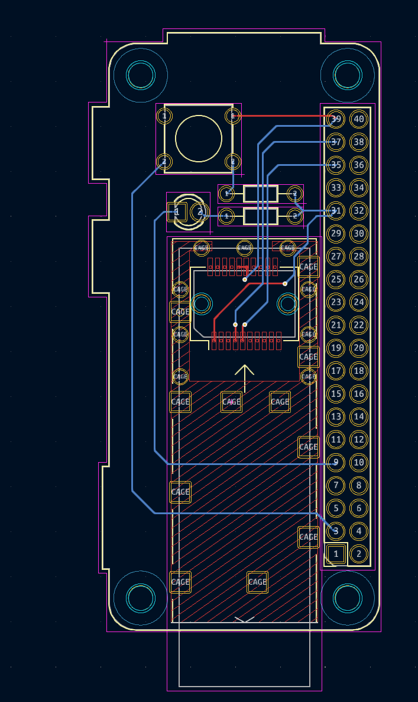
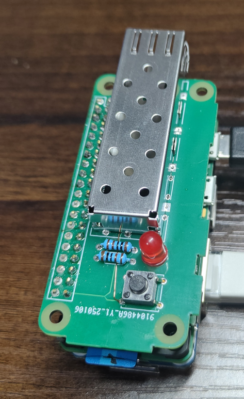

# sfp-tool

Raspberry Pi を使って、ボタンを押すと、SFPのEEPROMを書き換えるツールです。

内部では、[ruby-libsfp](https://github.com/kazubu/ruby-libsfp) を使っています。

## 基盤

[](./img/image.png)
[](./img/image2.png)

### 接続
SFP|Raspberry Pi
---|---
VCCT|3.3V
VCCR|3.3V
VEET|GND
SDA|SDA1
SDL|SCL1

LED は、GPIO 6 に接続しています。
ボタンは、GPIO 26 に接続しています。

## セットアップ

### i2cの有効化

* raspi-config を使って、I2Cを有効化します。
```bash
# raspi-config nonint do_i2c 0
```

### i2cのデバイスが生えているか確認

```bash
# ls -l /dev/i2c-*
```

/dev/i2c-1 があれば、OKです。

### SFPのEEPROMが見えるか

```bash
# apt-get install i2c-tools
```

```bash
# i2cdetect -y 1
     0  1  2  3  4  5  6  7  8  9  a  b  c  d  e  f
00:                         -- -- -- -- -- -- -- --
10: -- -- -- -- -- -- -- -- -- -- -- -- -- -- -- --
20: -- -- -- -- -- -- -- -- -- -- -- -- -- -- -- --
30: -- -- -- -- -- -- -- -- -- -- -- -- -- -- -- --
40: -- -- -- -- -- -- -- -- -- -- -- -- -- -- -- --
50: 50 51 -- -- -- -- -- -- -- -- -- -- -- -- -- --
60: -- -- -- -- -- -- -- -- -- -- -- -- -- -- -- --
70: -- -- -- -- -- -- -- --
```

0x50と0x51が表示されていれば、EEPROMが見えています。

## ボタンぽちの使い方

### 必要なソフトウェア、ライブラリのインストール

```bash
# apt-get install ruby git
# gem install i2c
```

### clone 

```bash
# git clone --recurse-submodules https://github.com/masa23/sfp-tool.git
# cd sfp-tool
```

### SPFのEEPROM書き換え内容を修正

```bash
# vi rewrite.rb
```

デフォルトでは、AristanのSFPのVendor NameをIntel Corpに書き換えるようになっています。

### インストール

```bash
# make install
```

### 状態確認

```bash
# journalctl -f -u sfp-tool.service
Jan XX XX:32:42 raspberrypi python3[2801]: SFP disconnected
Jan XX XX:33:43 raspberrypi python3[2801]: SFP connectied
Jan XX XX:33:46 raspberrypi python3[2801]: Push Button
Jan XX XX:33:46 raspberrypi python3[6859]: This is not an Arista SFP
Jan XX XX:33:46 raspberrypi python3[6859]: Vendor Name: Intel Corp
Jan XX XX:33:46 raspberrypi python3[2801]: Error: EEPROM flush failed.
```
